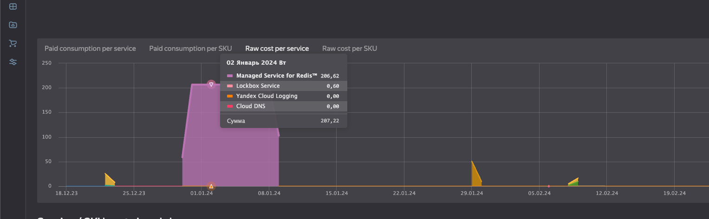
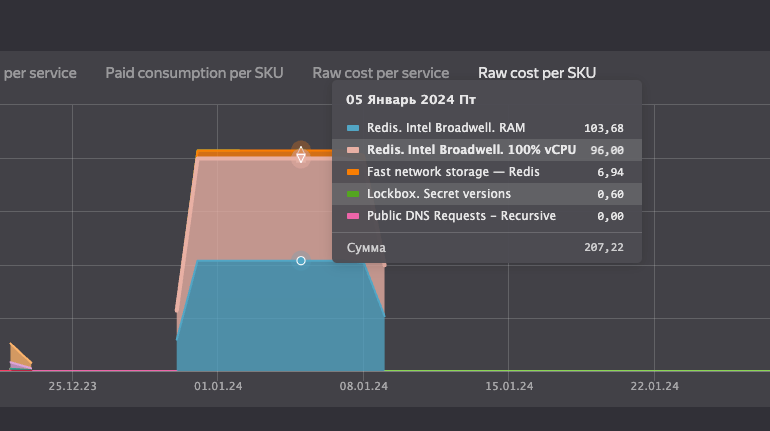
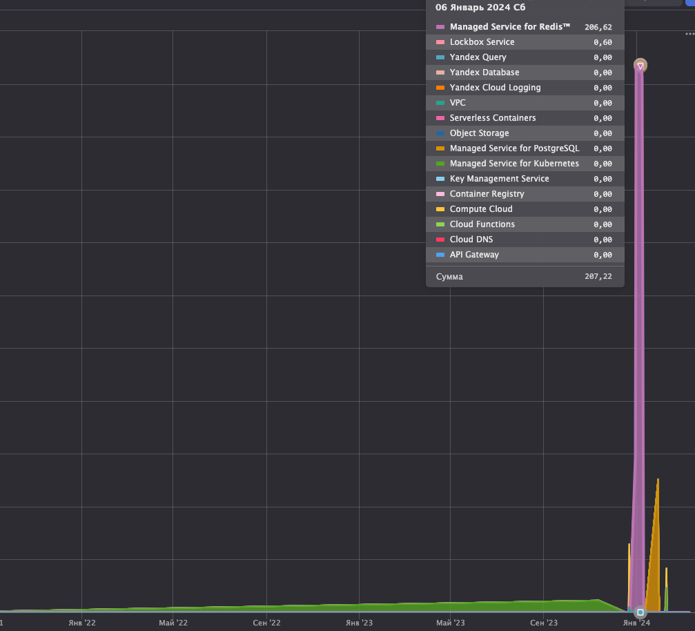

# Дашборд бюджета

Для своего аккаунта, выполнил следующую [инструкцию](https://cloud.yandex.ru/ru/docs/billing/operations/dashboard)

После этого система Yandex Cloud предложила предустановленные дашборды

- Cost Per Service 
- Cost Per SCU 
- Cost Per Service 

В целом из даиграм я вижу, что очень большая часть бюджета ушла на поддержку Managed Redis, который я забыл выключить после домашки =)