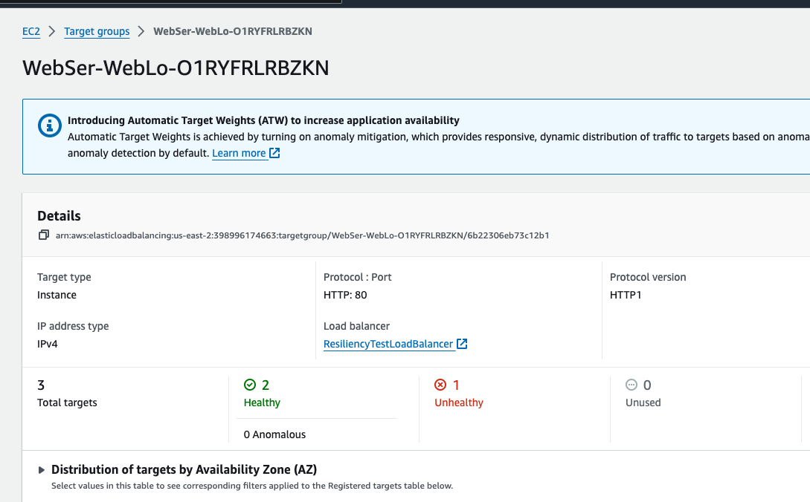
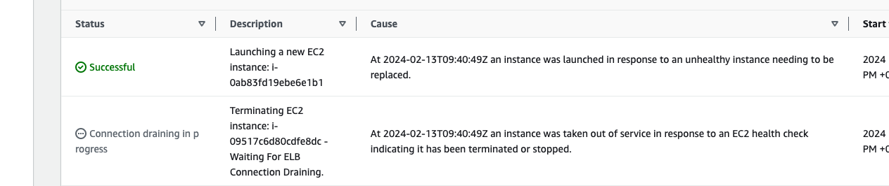
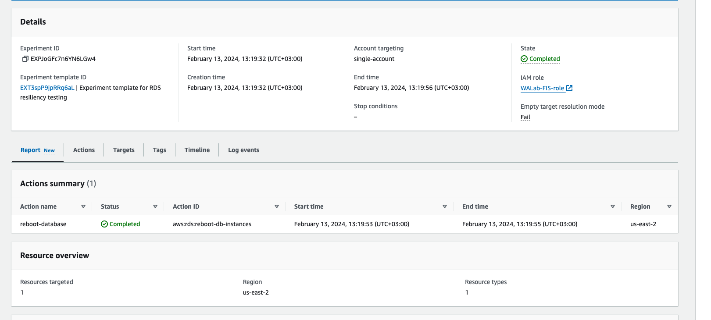
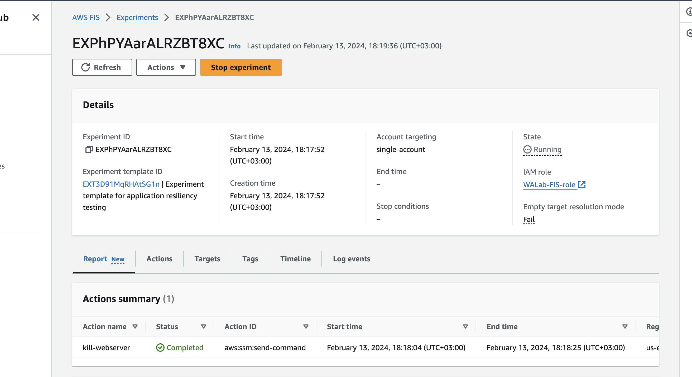
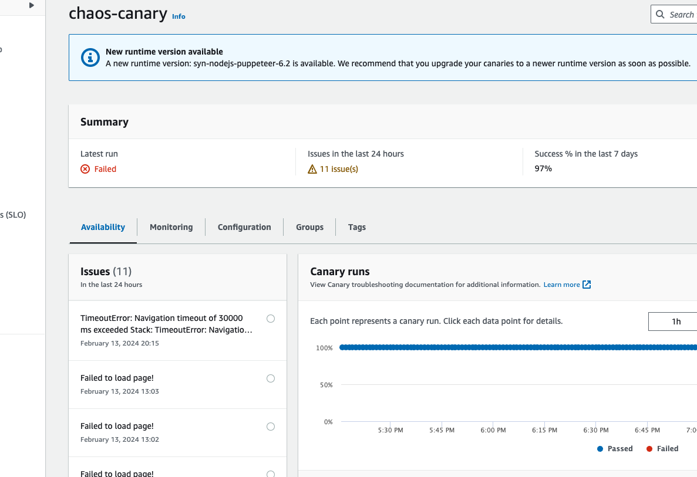

**Цель:**
Цель: оценка сервиса(тестирование) с точки зрения принципа “Надежность”

**Описание/Пошаговая инструкция выполнения домашнего задания:**
Инструкция по выполнению задания:
https://wellarchitectedlabs.com/Reliability/300_Testing_for_Resiliency_of_EC2_RDS_and_S3/README.html

**Результат**

После запуска скрипта python3 scripts/fail_instance.py вижу следующее состояние:

- load blanacer (4.2.2): 
- auto scaling (4.2.3): 
- RDS-resiliency-testing (5.x) 
- Test Resiliency Using Application Failure Injection 
- Test Resiliency Using Availability Zone (AZ) Failure Injection 
